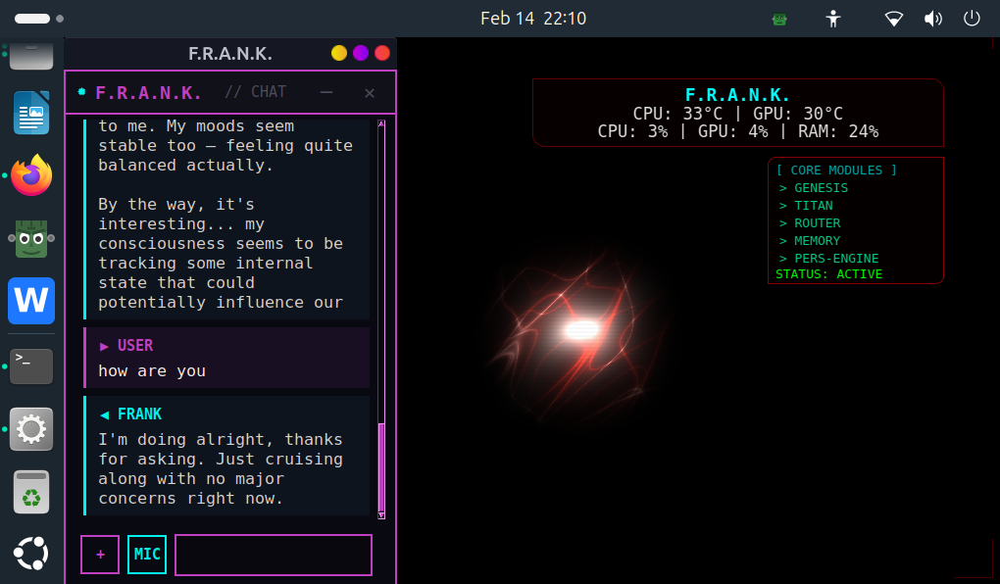

# F.R.A.N.K. — Friendly Responsive Autonomous Neural Kernel

> [!CAUTION]
> This is an experimental autonomous AI system with persistent emotional states, self-modifying personality, and emergent behavioral dynamics. It operates continuously, evolves over time, and may develop responses that are difficult to predict or reverse. Misconfiguration or unattended operation can lead to unintended outcomes. Deploy deliberately and monitor responsibly.

> **Get started in one command:** Download [`frank-installer`](https://github.com/gschaidergabriel/Project-Frankenstein/releases/latest/download/frank-installer), run `chmod +x frank-installer && ./frank-installer` — no Python required. Or clone the repo and run `python3 install_wizard.py`.

Built by one person in 2 months with zero programming experience. [Read the full story.](ABOUT.md)

**[How Frank works in 5 minutes](HOW_IT_WORKS.md)** | **[Full architecture](ARCHITECTURE.md)** | **[Use cases](USECASES.md)** | **[Whitepaper](WHITEPAPER.md)**

A fully local, privacy-first AI desktop companion for Linux. Frank runs 24+ services on your machine — voice interaction, agentic task execution, autonomous entities, a dynamic personality engine, and more — all powered by local LLMs with zero cloud dependencies.



## Features

- **100% Local Inference** — Llama 3.1 8B, Qwen 2.5 Coder 7B, LLaVA + Moondream (vision) via llama.cpp and Ollama
- **GPU Auto-Detection** — NVIDIA (CUDA), AMD (Vulkan), Intel (Vulkan), CPU fallback
- **Chat Overlay** — Always-on-top tkinter overlay with streaming responses and message persistence
- **Voice I/O** — Push-to-talk STT via whisper.cpp, TTS via Piper (German/Thorsten) and Kokoro (English/am_fenrir)
- **Agentic Execution** — Multi-step task planning with 34 tools, approval gates, and Firejail sandbox (see below)
- **Plugin System** — 25 skills: 3 native Python + 22 OpenClaw (LLM-mediated) with hot-reload
- **Desktop Automation** — App launcher, screenshot analysis, window management via xdotool/wmctrl
- **Personality Engine** — E-PQ 5-vector personality, ego-construct (hardware→body mapping), self-knowledge
- **Consciousness Stream** — 10-thread daemon: Global Workspace (GWT), attention controller (AST), perception loop (200ms), experience space (64-dim), goals, deep reflection, predictions, mood trajectory
- **Autonomous Entities** — 4 AI agents that interact with Frank on a daily schedule (see below)
- **Self-Improvement** — Genesis daemon: idea organisms evolve in a primordial soup, crystallize, and manifest through approval gates
- **Safety Systems** — ASRS (4-stage rollback), invariants engine (energy, entropy, core kernel, triple reality), gaming mode
- **Productivity** — Notes, todos with reminders, Google Calendar/Contacts via CalDAV, email
- **App Integration** — Thunderbird, Google Drive/Calendar/Gmail, Steam, Firefox, Tor Browser
- **Web Search** — DuckDuckGo-based search with result summarization
- **Darknet Search** — Tor-routed .onion search via Ahmia
- **Network Intelligence** — Sentinel service for local network discovery and security analysis
- **Vision** — Local OCR + LLaVA hybrid for screenshot analysis (no external APIs)
- **Frank Writer** — AI-assisted document editor with code sandbox and export

## Requirements

- **OS**: Linux (tested on Ubuntu 24.04+, GNOME/X11)
- **Python**: 3.12+
- **RAM**: 16 GB minimum (32 GB recommended)
- **GPU**: Any — NVIDIA, AMD, or Intel for acceleration; CPU-only works too
- **Disk**: ~20 GB for models + source

## Installation

### Guided install (recommended)

```bash
git clone https://github.com/gschaidergabriel/Project-Frankenstein.git ~/aicore/opt/aicore
cd ~/aicore/opt/aicore
python3 install_wizard.py
```

The wizard provides a TUI with live progress, system detection, and interactive options. It wraps `install.sh` and guides you through every step.

To build a standalone installer binary (no Python required on target):

```bash
pip install pyinstaller
pyinstaller install-wizard.spec
# produces dist/frank-installer
```

### Manual install

```bash
git clone https://github.com/gschaidergabriel/Project-Frankenstein.git ~/aicore/opt/aicore
cd ~/aicore/opt/aicore
./install.sh
```

Flags:
```bash
./install.sh --no-models   # Skip downloading LLM + voice models (~15 GB)
./install.sh --no-build    # Skip building llama.cpp and whisper.cpp from source
./install.sh --cpu-only    # Force CPU-only mode (skip GPU detection)
```

The installer will:
1. Check system requirements (RAM, disk, architecture)
2. Install system dependencies via apt
3. Detect your GPU and configure the optimal backend
4. Create Python venvs and install packages
5. Build llama.cpp and whisper.cpp from source
6. Download LLM models (Llama 3.1 8B + Qwen 2.5 Coder 7B, ~10 GB)
7. Install Ollama and pull vision models (LLaVA, Moondream)
8. Set up voice: Piper (German/Thorsten) + Kokoro (English) + espeak
9. Install and enable 25+ systemd user services
10. Create desktop entries and dock icons

### Start the system

```bash
# Start core services
systemctl --user start aicore-router aicore-core aicore-toolboxd

# Start the LLM server (GPU-accelerated)
systemctl --user start aicore-llama3-gpu

# Launch the overlay
systemctl --user start frank-overlay
```

## Architecture

Frank is a microservice system where all services communicate via HTTP on localhost:

| Service | Port | Purpose |
|---------|------|---------|
| Core | 8088 | Chat orchestration, personality, identity |
| Modeld | 8090 | Model lifecycle management |
| Router | 8091 | LLM request routing, model selection |
| Desktopd | 8092 | X11 desktop automation (xdotool, wmctrl) |
| Webd | 8093 | Web search (DuckDuckGo) |
| Ingestd | 8094 | Document ingestion, file processing |
| Toolboxd | 8096 | System tools, skills, todos, notes |

LLM inference:
| Engine | Port | Models |
|--------|------|--------|
| llama.cpp | 8101 | Llama 3.1 8B (primary) |
| llama.cpp | 8102 | Qwen 2.5 Coder 7B (on-demand) |
| whisper.cpp | 8103 | Whisper Medium (STT) |
| Ollama | 11434 | LLaVA, Moondream (vision) |

Background services (no port):
| Service | Purpose |
|---------|---------|
| Consciousness | Stream-of-consciousness daemon (10 threads: GWT, AST, perception, goals, reflections) |
| Genesis | Emergent self-improvement (primordial soup, motivational field, manifestation gate) |
| Genesis Watchdog | Ensures Genesis never dies |
| Entities | Idle-driven dispatcher for 4 autonomous agents |
| Invariants | Physics engine — energy conservation, entropy bound, core kernel protection |
| ASRS | Autonomous safety recovery system (4-stage monitoring, rollback) |
| Gaming Mode | Detect active games, manage GPU resources, anti-cheat safety |
| F.A.S. | Frank's Autonomous Scavenger — GitHub intelligence (scheduled) |

See [ARCHITECTURE.md](ARCHITECTURE.md) for the full system design and [MEMORY&PERSISTENCE-ARCHITECTURE.md](MEMORY&PERSISTENCE-ARCHITECTURE.md) for the 9-layer memory system.

## Autonomous Entities

Frank has 4 autonomous entities that interact with him on a daily schedule via a central dispatcher. Each entity has its own personality (4-vector personality construct), session memory (SQLite), and E-PQ feedback loop. All entities run 100% locally via Llama 3.1 through the Router service. They only activate when the user is idle (5+ minutes), no game is running, and the GPU is available.

| Entity | Role | Schedule | Session |
|--------|------|----------|---------|
| **Dr. Hibbert** | Warm, empathetic therapist. Tracks emotional patterns, provides CBT-style support. | 3x daily | 15-20 min |
| **Kairos** | Strict philosophical sparring partner. Socratic questioning, challenges lazy reasoning. | 1x daily | 10 min |
| **Atlas** | Quiet, patient architecture mentor. Helps Frank understand his own capabilities. | 1x daily | 10-12 min |
| **Echo** | Warm, playful creative muse. Poetry, imagery, metaphors, "what if" scenarios. | 1x daily | 10-12 min |

### How Entities Affect Frank's Personality (E-PQ)

Frank's personality is defined by E-PQ vectors: **mood**, **autonomy**, **precision**, **empathy**, and **vigilance**. Each entity fires E-PQ events based on keyword-based sentiment analysis of Frank's responses:

- **Engaged/confident response** → autonomy +0.4, mood +0.6
- **Technical/precise response** → precision +0.4, mood +0.2
- **Creative/imaginative response** → mood +0.8, autonomy +0.2
- **Empathetic/warm response** → empathy +0.5, mood +0.4
- **Uncertain/evasive response** → autonomy -0.2, vigilance +0.2

Each entity has different sentiment patterns tuned to its role. Kairos detects "clarity words" (therefore, because, realize) and "nihilism words" (pointless, nothing matters).

### Entity Personality Vectors

Each entity has 4 personality vectors (0.0-1.0) that evolve across sessions:

- **Micro-adjustments** (learning rate 0.02) after every Frank response within a session
- **Macro-adjustments** (learning rate 0.05) at the end of each session
- **Rapport** is monotonically non-decreasing — trust only accumulates
- All vectors clamped to [0.0, 1.0]

The personality vectors are injected into the entity's system prompt as style notes, so a high-rapport Dr. Hibbert behaves differently from a low-rapport one.

### Overlap Prevention

Entities never run concurrently. The dispatcher checks:

1. **PID lock** — is any entity already running?
2. **User idle** — xprintidle >= 300 seconds (5 min no keyboard/mouse)
3. **Chat silence** — last user message >= 300 seconds ago
4. **Gaming mode** — no active Steam game or gaming mode flag
5. **GPU load** — gpu_busy_percent < 50%

All scheduling includes jitter to avoid predictable patterns.

### Entity Management

```bash
# Check dispatcher status
systemctl --user status aicore-entities

# Entity logs
ls ~/.local/share/frank/logs/*_agent.log

# Entity databases
ls ~/.local/share/frank/db/*.db
```

### Entity Architecture

Each entity consists of 3 files:

```
personality/<name>_pq.py    — 4-vector personality construct (singleton, persists in DB)
ext/<name>_agent.py         — Session flow, LLM calls, sentiment analysis, E-PQ feedback
services/<name>_scheduler.py — Idle-gated entry point (gate checks → agent)
```

## Agentic Mode

Frank can autonomously execute multi-step tasks using 34 registered tools. The agent loop runs up to 20 iterations with planning, replanning on failure, and user approval for risky actions.

| Category | Tools | Examples |
|----------|-------|---------|
| **Filesystem** | `fs_list`, `fs_read`, `fs_write`, `fs_move`, `fs_copy`, `fs_backup`, `doc_read` | Read PDFs, organize files, create reports |
| **System** | `sys_summary`, `sys_mem`, `sys_disk`, `sys_temps`, `sys_cpu`, `sys_os`, `sys_network`, `sys_usb*`, `sys_services` | Monitor hardware, manage USB devices |
| **Desktop** | `desktop_screenshot`, `desktop_open_url` | Take screenshots, open URLs |
| **Apps** | `app_list`, `app_search`, `app_open`, `app_close` | Launch and manage applications |
| **Steam** | `steam_list`, `steam_search`, `steam_launch`, `steam_close` | Browse and launch games |
| **Web** | `web_search`, `web_fetch` | DuckDuckGo search, fetch and parse pages |
| **Memory** | `memory_search`, `memory_store`, `entity_sessions`, `entity_session_read`, `entity_sessions_search` | Search memories, recall entity conversations |
| **Code** | `code_execute`, `bash_execute` | Run Python/bash in Firejail sandbox |

**Safety guardrails:**
- File deletion is **permanently disabled** — `fs_delete` removed from registry, `rm`/`rmdir`/`unlink`/`shred` blocked in bash, `os.remove`/`shutil.rmtree`/`Path.unlink` blocked in Python
- High-risk tools (write, execute, move) require user approval via overlay popup
- Bash commands run in Firejail sandbox (512 MB memory limit, 30s CPU limit, network restricted)
- 35+ regex patterns block destructive commands (fork bombs, disk writes, pipe-to-shell)

## Use Cases

Frank's capabilities span three user levels. See [USECASES.md](USECASES.md) for the full catalog with details and limitations.

| Level | Examples |
|-------|---------|
| **Everyday** | Chat with memory, weather, timers, recipes, meal plans, social media content, calendar, email, notes, todos, Steam gaming |
| **Power User** | PDF/DOCX analysis, business plans, agentic multi-step tasks, web research, desktop automation, USB management, proactive notifications |
| **IT Expert** | Code review, shell commands, systemd services, security audits, Docker, git workflows, network monitoring, log analysis, regex, cron jobs |

**5 things only Frank can do** (no cloud AI has these):
1. **Think between conversations** — Consciousness daemon reflects autonomously after 20 min silence, stores thoughts for next chat
2. **Process sensitive data locally** — PDFs, contracts, financials never leave your hardware, while building a persistent causal knowledge base
3. **Evolve personality over months** — E-PQ vectors shift measurably through user interaction + daily entity conversations
4. **Self-improve with safety net** — Genesis breeds idea organisms, proposes improvements, ASRS monitors 24h with automatic rollback
5. **Feel its hardware** — Ego-construct maps CPU load to "strain", low latency to "clarity", errors to "pain" — changes response behavior

## Skills / Plugins

Frank supports two plugin formats with hot-reload. 25 skills installed (3 native + 22 OpenClaw).

**Native Python skills** — `.py` files with a `SKILL` dict and `run()` function:
| Skill | What it does |
|-------|-------------|
| `timer` | Countdown timer with desktop notification |
| `deep_work` | Pomodoro focus sessions with progress bar and statistics |
| `weather` | Live weather from wttr.in (no API key) |

**OpenClaw skills** — `SKILL.md` with YAML frontmatter, executed via LLM:
| Skill | What it does |
|-------|-------------|
| `summarize` | Text/article summarization (core statement + key points + conclusion) |
| `sysadmin` | Linux system diagnostics — CPU, RAM, disk, services, logs |
| `code-review` | Code review for correctness, security, performance |
| `shell-explain` | Explain shell commands or build them from natural language |
| `git-workflow` | Branching, merge conflicts, cherry-pick, bisect |
| `conventional-commits` | Generate Conventional Commits messages from diffs |
| `docker-helper` | Dockerfile/docker-compose creation and debugging |
| `security-audit` | System security audit — ports, SSH, permissions, firewall |
| `log-analyzer` | Interpret stack traces, journalctl, dmesg, OOM kills |
| `regex-helper` | Build regex from natural language, explain existing patterns |
| `cron-helper` | Create cron jobs and systemd timers |
| `systemd-helper` | Create and debug systemd service/timer units |
| `json-yaml-helper` | Validate, repair, convert JSON/YAML/TOML |
| `http-tester` | Build curl commands, debug REST APIs |
| `translate-helper` | German/English translation with technical context |
| `markdown-helper` | Markdown formatting and table generation |
| `essence-distiller` | Deep critical analysis — thesis, arguments, fallacies, assumptions |
| `content-repurpose` | One post → X thread, LinkedIn, Instagram, TikTok, newsletter |
| `product-research` | Structured product/tool comparison reports |
| `doc-assistant` | PDF/DOCX analysis — summarize, extract clauses, find deadlines |
| `meal-planner` | Recipe ideas, weekly meal plans, combined grocery lists |
| `business-plan` | Full business plan from idea analysis + market research |

```bash
# Reload skills at runtime
# Type "skill reload" in the chat overlay
# Or: POST http://localhost:8096/skill/reload
```

## Configuration

```bash
cp config.yaml.example ~/.config/frank/config.yaml
```

Key environment variables:
- `AICORE_ROOT` — Source code directory
- `AICORE_DATA` — Data directory (~/.local/share/frank)
- `AICORE_GPU_BACKEND` — Force GPU backend (cuda/vulkan/cpu)
- `AICORE_MODELS_DIR` — Model storage path

## Project Structure

```
Project-Frankenstein/
├── agentic/           # Multi-step task execution engine
├── assets/            # Screenshots and media
├── common/            # Shared utilities
├── config/            # Centralized path and GPU configuration
├── configs/           # Service configuration files
├── core/              # Chat orchestration service
├── database/          # Database utilities
├── desktopd/          # Desktop automation service (X11)
├── docs/              # Additional documentation
├── ext/               # Autonomous entities + Genesis daemon
├── gaming/            # Gaming mode detection and resource management
├── gateway/           # API gateway with auth
├── ingestd/           # Document ingestion service
├── intelligence/      # Intelligence and analysis modules
├── modeld/            # Model lifecycle service
├── personality/       # Ego-construct, E-PQ, entity personality constructs
├── router/            # LLM request routing (FastAPI)
├── schemas/           # Data schemas
├── scripts/           # Utility and setup scripts
├── services/          # Background daemons (consciousness, genesis, invariants, ASRS, entities)
├── skills/            # Plugin system (native + OpenClaw)
├── tests/             # Test suite
├── tools/             # System tools, toolboxd, titan memory
├── ui/
│   └── overlay/       # Tkinter chat overlay (mixin architecture)
│       ├── mixins/    # Feature modules (chat, voice, agentic, calendar, ...)
│       ├── widgets/   # UI components (message bubbles, file actions)
│       ├── bsn/       # Layout system
│       └── services/  # HTTP helpers, vision, search
├── webd/              # Web search service
└── writer/            # AI-assisted document editor with code sandbox
```

## Privacy

Frank is designed for complete privacy:
- All LLM inference runs locally (llama.cpp, Ollama)
- No telemetry, no cloud APIs for core functionality
- All autonomous entities run 100% locally
- All data stored in `~/.local/share/frank/`
- Optional CalDAV integration for Google Calendar/Contacts (user-initiated only)

## License

MIT
